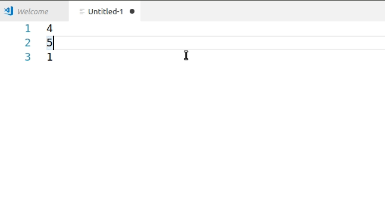
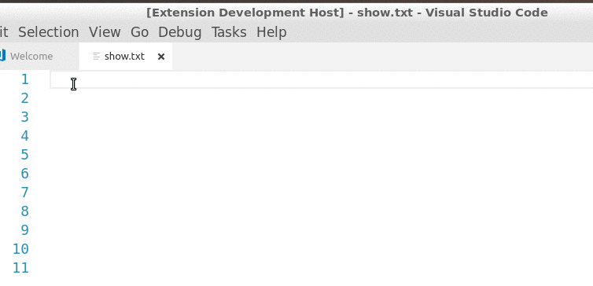
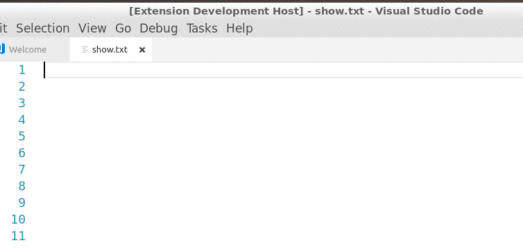
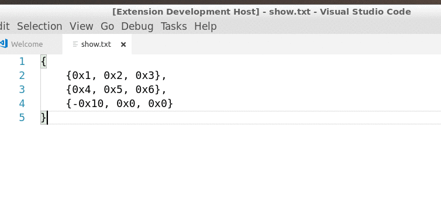

# NumberMonger

Lightweight extension to VSCode to help you deal with numbers. No settings, everything can be configured through the command bar.

## Features

NumberMonger lets you
1. sum up sequences of numbers in floating point, integer, hexidecimal or binary representation
2. use multiple cursors to insert sequences of numbers with arbitrary initial values and step 
3. insert sequences of random integers
4. convert between hexadecimal, binary and decimal numbers

All features are accessed through the command bar (ctrl+p).

* Sum Sequence, even when they're inside arrays! Also shows mean, standard deviation and median of the sequence.

* Insert Sequence of hex, dec or bin numbers with arbitrary start, step size, right or left alignment and zero padding.

* Insert Random Sequence.

* Convert between hex, dec and bin representations, even inside arrays!

## Acknowledgements

Thank you for the amazing Yeoman VSCode extension generator! 

## Known Issues

## Release Notes

### 0.2.1
* Fixed median bug.

### 0.2.0
* Support for floating point summation
* Additional information about the sequence (mean, median, standard deviation)

### 0.1.4
* Fixed uncaught exception when escaping from user prompts

### 0.1.3
+ Fixed test folder being downloaded with extension from marketplace by adding .vscodeignore

### 0.1.1
* Added Icon
* Refactored Code

### 0.1.0
* First release.